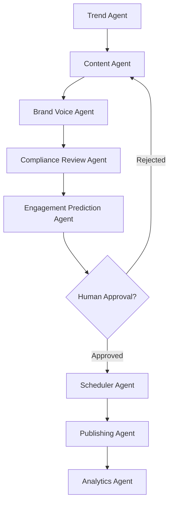

<div align="center">
  
  <h1 align="center">AgentSphere</h1>
  <h3>Autonomous Multi-Agent AI Social Media Management & Marketing Platform</h3>
  
  <p align="center">
    <a href="https://github.com/Rxhulnxyak/Al-Social-Media-Agent/stargazers"></a>
    <a href="https://github.com/Rxhulnxyak/Al-Social-Media-Agent/network/members"></a>
    <a href="https://github.com/Rxhulnxyak/Al-Social-Media-Agent/issues"></a>
    <a href="https://github.com/Rxhulnxyak/Al-Social-Media-Agent/blob/main/LICENSE"></a>
  </p>
</div>

<hr/>

## 📖 Abstract

**AgentSphere** is a next-generation AI-powered social media automation platform engineered with **LangGraph** and a **Multi-Agent Systems (MAS)** architecture. The system autonomously researches live trends, generates platform-specific content (LinkedIn, Twitter/X, Instagram), strictly enforces brand voice, predicts content engagement via machine learning, coordinates human-in-the-loop approval, schedules posts, and aggregates analytics.

Unlike traditional schedulers, AgentSphere deploys an entire "AI Marketing Team" that works collaboratively to orchestrate the full social media lifecycle autonomously.

---

## 🧠 Multi-Agent Architecture

The LangGraph Orchestrator coordinates 8 specialized AI Agents, each with distinct system prompts and tools:

1. 🔍 **Trend Research Agent**: Scrapes web data to identify rising hashtags and competitor strategies.
2. ✍️ **Content Generation Agent**: Generates highly-engaging platform-specific content grounded via RAG.
3. 🛡️ **Brand Voice Agent**: A Brand Guardian that strictly enforces corporate tone and prevents hallucinations.
4. 🚦 **Compliance Review Agent**: Evaluates generated text for toxicity, spam, and factual accuracy.
5. 📈 **Engagement Prediction Agent**: Uses heuristics and past campaign data to predict post virality (Score 1-10).
6. 🧑‍⚖️ **Approval Workflow Agent**: Suspends the graph state to request "Human-In-The-Loop" authorization.
7. 🗓️ **Scheduler Agent**: Determines optimal delivery times based on time-zone and audience activity.
8. 🚀 **Publishing & Analytics Agent**: Publishes via APIs and collects impressions, reach, and conversion metrics.



---

## 🛠️ Advanced Technology Stack

### 🚀 Frontend (Client Tier)
- **Framework**: Next.js 14 (App Router)
- **Styling**: Tailwind CSS & Framer Motion
- **UI Components**: ShadCN UI + Lucide Icons
- **State Management**: React Context & SWR

### 🧠 Backend (API & AI Tier)
- **Framework**: FastAPI (Python 3.11)
- **AI Orchestration**: LangGraph, LangChain
- **LLM Models**: OpenAI GPT-4o / Claude 3 Opus
- **Vector DB / RAG**: Pinecone / ChromaDB

### 🗄️ Database & Infrastructure (Data Tier)
- **Primary Database**: PostgreSQL (via SQLAlchemy / Alembic)
- **Caching & Queue**: Redis
- **Containerization**: Docker & Docker Compose
- **Deployment**: AWS (ECS) / Kubernetes

---

## 💻 Getting Started

### Prerequisites
- Docker & Docker Compose
- Node.js >= 20.0
- Python >= 3.11
- OpenAI API Key

### Local Setup (One-Click)

The entire stack (Frontend, Backend, PostgreSQL, Redis) is completely containerized.

1. **Clone the repository:**
   ```bash
   git clone https://github.com/Rxhulnxyak/Al-Social-Media-Agent.git
   cd Al-Social-Media-Agent
   ```

2. **Configure Environment Variables:**
   Create a `.env` file in the root directory:
   ```env
   OPENAI_API_KEY=sk-your_api_key_here
   POSTGRES_USER=postgres
   POSTGRES_PASSWORD=postgres
   POSTGRES_DB=agentsphere
   ```

3. **Spin up the cluster:**
   ```bash
   docker-compose up --build
   ```

4. **Access the Application:**
   - **Marketing Dashboard**: `http://localhost:3000`
   - **Backend API Docs (Swagger)**: `http://localhost:8000/docs`

---

## 🌟 Advanced Features

- **RAG Knowledge Base**: Inject company documents, brand guidelines, and previous high-performing posts into the AI context window.
- **Self-Healing LLM Workflows**: If the *Brand Voice Agent* rejects a draft, the graph autonomously loops back to the *Content Agent* with explicit instructions on what to fix.
- **Long-term AI Memory**: Uses Redis to retain memory of past user decisions and campaign successes.

---

## 🤝 Contributing
Contributions are what make the open source community such an amazing place to learn, inspire, and create. Any contributions you make are **greatly appreciated**.

1. Fork the Project
2. Create your Feature Branch (`git checkout -b feature/AmazingFeature`)
3. Commit your Changes (`git commit -m 'Add some AmazingFeature'`)
4. Push to the Branch (`git push origin feature/AmazingFeature`)
5. Open a Pull Request

## 📄 License
Distributed under the MIT License. See `LICENSE` for more information.
